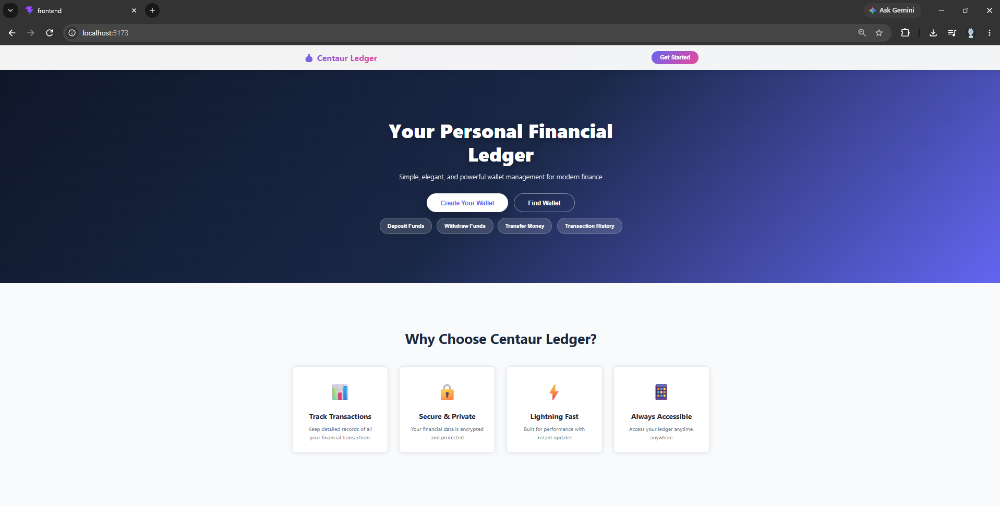
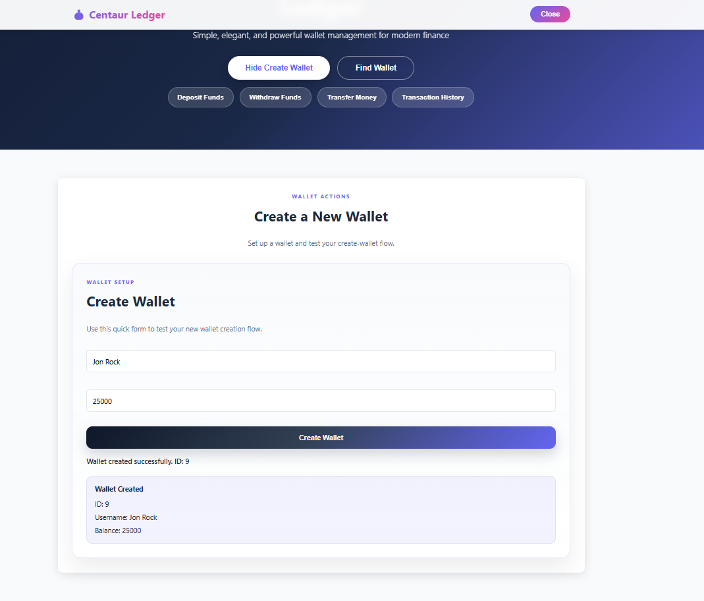
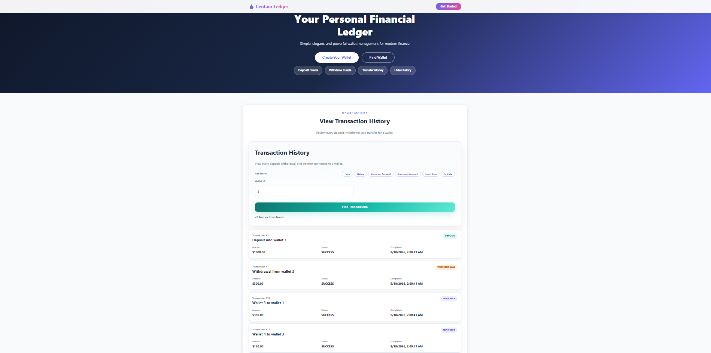
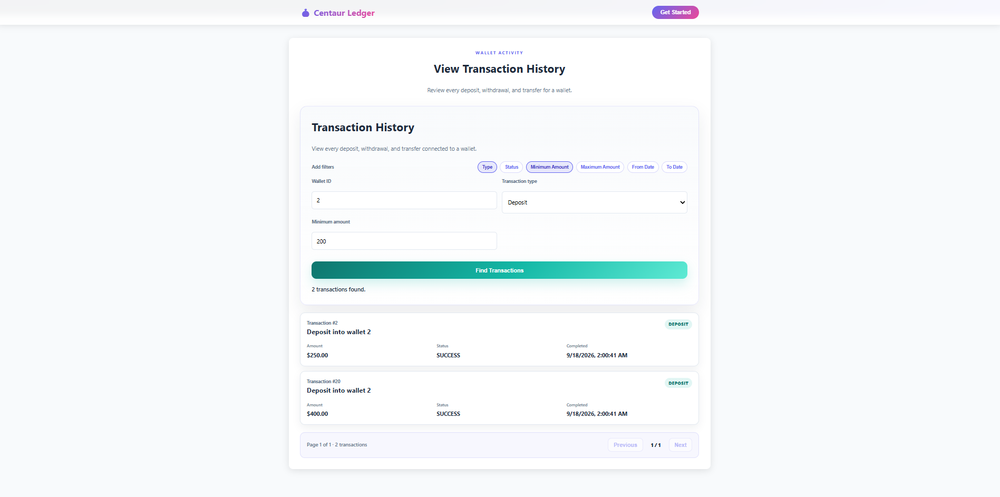

# Centaur Ledger

> A full-stack digital wallet and transaction platform built with Spring
> Boot, React, PostgreSQL, and Docker.

Centaur Ledger is a portfolio-scale financial transaction system for
creating and managing digital wallets, performing deposits and
withdrawals, executing peer-to-peer transfers, and exploring transaction
history.

Centaur Ledger started as a project for learning Spring Boot and grew into a complete full-stack application. Beyond the core wallet functionality, I used the project to explore transactional operations, concurrency, dynamic database queries, testing, database migrations, CI, and containerizing a multi-service application with Docker.



## Features

### Wallet Management

-   Create digital wallets.
-   Retrieve wallet information and current balances.
-   Deposit funds into a wallet.
-   Withdraw funds with balance validation.
-   Persist wallet data in PostgreSQL.

### Peer-to-Peer Transfers

Centaur Ledger supports transfers between wallets while maintaining
balance consistency. Transfer operations execute within a Spring
transactional boundary so related balance changes and transaction work
are handled as a single unit of work.

The service validates sender/receiver existence, self-transfers,
insufficient funds, and invalid transfer amounts. Successful operations
are recorded in transaction history.

### Transaction History

Wallet activity is recorded as `DEPOSIT`, `WITHDRAWAL`, or `TRANSFER`.
Transaction history supports server-side pagination so clients retrieve
manageable pages instead of an entire transaction dataset.

### Dynamic Filtering

Transaction history can be filtered by optional criteria including
transaction type, transaction status, minimum/maximum amount, and
start/end dates.

Dynamic queries are constructed using Spring Data JPA Specifications,
allowing filters to be composed without maintaining a separate
repository query for every possible combination.

### Concurrency Protection

Wallet entities use optimistic locking through JPA's `@Version`
mechanism. This allows the persistence layer to detect stale conflicting
wallet updates rather than silently allowing one update to overwrite
another.

### Validation and Error Handling

The REST API includes request validation and centralized exception
handling for invalid operations and application errors, providing
consistent HTTP responses without exposing internal exceptions directly
to clients.

## Architecture

``` text
Browser
   |
   | HTTP
   v
+-----------------------+
| React / Vite Frontend |
| localhost:5173        |
+-----------+-----------+
            |
            | REST / JSON
            v
+-----------------------+
| Spring Boot REST API  |
| localhost:8080        |
|                       |
| Controller            |
|     |                 |
|     v                 |
| Service               |
|     |                 |
|     v                 |
| Repository / JPA      |
+-----------+-----------+
            |
            | JDBC
            v
+-----------------------+
| PostgreSQL            |
| persistent data       |
+-----------------------+

Managed locally with Docker Compose
```

The backend follows a layered architecture:

``` text
HTTP Request
    |
    v
Controller
    |
    v
Service / Business Logic
    |
    v
Repository
    |
    v
JPA / Hibernate
    |
    v
PostgreSQL
```

## Technology Stack

| Area | Technologies |
| --- | --- |
| **Backend** | Java, Spring Boot |
| **Frontend** | React, Vite, JavaScript |
| **Database** | PostgreSQL |
| **Persistence** | Spring Data JPA, Hibernate |
| **Database Migrations** | Flyway |
| **Testing** | JUnit, Spring Boot Test, H2 |
| **Build** | Maven |
| **Containers** | Docker, Docker Compose |
| **Frontend Web Server** | Nginx |
| **CI** | GitHub Actions |
| **API Testing** | Postman |
| **Version Control** | Git / GitHub |

## Run the Complete Application

The complete application is containerized. A tester does **not** need to
install Java, Maven, PostgreSQL, Node.js, or Nginx individually.

### Prerequisites

Install Git and Docker Desktop, then make sure Docker Desktop is
running.

### 1. Clone the Repository

Replace the placeholder with this repository's GitHub URL:

``` bash
git clone https://github.com/HarunHashim/Ledger_API.git
cd Ledger_API
```

### 2. Build and Start the Stack

From the repository root:

``` bash
docker compose up --build
```

Docker Compose will create the application network, start PostgreSQL,
wait for it to become healthy, start the Spring Boot backend,
initialize the database schema, build the React frontend, and serve it
through Nginx.

Once startup completes, open:

``` text
http://localhost:5173
```

The REST API is exposed at:

``` text
http://localhost:8080
```

### 3. Stop the Application

``` bash
docker compose down
```

PostgreSQL uses a Docker volume, so data survives normal container
restarts.

### Resetting the Local Database

For a completely fresh database:

``` bash
docker compose down -v
docker compose up --build
```

> **Warning:** `docker compose down -v` removes the PostgreSQL Docker
> volume and deletes all locally stored application data.

## Load Demo Data

Centaur Ledger includes an optional Python script under `scripts/` for
populating a fresh development database through the application's REST
API.

With the Docker stack running , run :

``` bash
python scripts/seed_demo.py
```

The script creates sample wallets and demo deposits, withdrawals, and
peer-to-peer transfers. The demo wallets IDs run from (1 - 8) for the purposes of testing. Because it uses the application's REST API
rather than inserting directly into PostgreSQL, the demo data passes
through the same application logic as normal user activity.

The script uses `requests`. If it is not installed:

``` bash
pip install requests
```

A clean-demo workflow is:

``` bash
docker compose down -v
docker compose up --build
```

Then, after the backend is ready, run in another terminal:

``` bash
python scripts/seed_demo.py
```

Open `http://localhost:5173` to explore the populated application.

## Docker Environment

The local environment contains three services:

``` text
+------------------------------------------------+
|                 Docker Compose                 |
|                                                |
|  +----------------+                            |
|  | Frontend       |                            |
|  | React + Nginx  | host :5173 -> :80          |
|  +-------+--------+                            |
|          |                                     |
|          | REST                                |
|          v                                     |
|  +----------------+       +----------------+   |
|  | Backend        | JDBC  | PostgreSQL     |   |
|  | Spring Boot    +------>| :5432 internal |   |
|  | host :8080     |       | persistent vol |   |
|  +----------------+       +----------------+   |
|                                                |
+------------------------------------------------+
```

Docker Compose provides an internal network between services. The
backend reaches PostgreSQL through the Compose service hostname instead
of depending on a database installed on the host machine. PostgreSQL
uses a named volume so data persists when containers are normally
stopped/recreated.

## Database Migrations

Database schema changes are managed using Flyway. Migration files live
under:

``` text
src/main/resources/db/migration/
```

On a fresh database, the configured migrations establish the expected
schema before Hibernate validates it. This makes database structure
reproducible across environments.

## Testing

Backend tests can be executed with the Maven wrapper.

### Windows

``` powershell
.\mvnw.cmd test
```

### macOS / Linux

``` bash
./mvnw test
```

The test configuration uses an isolated H2 database rather than the
development PostgreSQL database. Tests cover core wallet and transaction
behavior including deposits, withdrawals, transfers, validation, and
transaction filtering.

## Continuous Integration

The repository includes a GitHub Actions workflow that runs the backend
test suite when changes are pushed, providing an automated check of core
application behavior as the codebase changes.

## Project Structure

``` text
Ledger_API/
|
+-- frontend/                  # React/Vite frontend
|   +-- src/
|   +-- Dockerfile
|   +-- .dockerignore
|
+-- scripts/
|   +-- seed_demo.py           # Optional demo-data generator
|
+-- src/
|   +-- main/
|   |   +-- java/              # Spring Boot application
|   |   +-- resources/
|   |       +-- db/migration/  # Flyway migrations
|   |
|   +-- test/                  # Backend tests
|
+-- .github/
|   +-- workflows/             # GitHub Actions CI
|
+-- .dockerignore
+-- Dockerfile                 # Backend image
+-- docker-compose.yml         # Full local stack
+-- pom.xml                    # Maven configuration
+-- README.md
```

## Engineering Decision Highlights

### Transactional Integrity

Money movement involves related state changes that must remain
consistent. The service layer uses Spring transactional operations so
associated work can succeed or fail as a unit instead of leaving
partially applied transfer state.

### Optimistic Concurrency Control

Wallets use JPA optimistic locking through a version field. Conflicting
stale updates can therefore be detected rather than silently overwriting
a newer wallet state.

### Composable Querying

Transaction filtering uses JPA Specifications. Optional criteria can be
composed dynamically while retaining server-side pagination.

### Layered API Design

Controllers handle HTTP concerns, services contain business rules,
repositories handle persistence, and DTOs/validation define the API
boundary.

### Reproducible Development Environment

The frontend, backend, and PostgreSQL database can be built and started
through Docker Compose. A fresh clone can reproduce the application
without manually matching local Java, Node, database, and web-server
installations.

### Automated Verification

Spring Boot tests and GitHub Actions provide repeatable checks of core
backend behavior.

## Screenshots


### Application Dashboard


### Wallet Creation 



### Transaction History



### Transaction Filtering



## Quick Reviewer Path

For someone who wants the shortest path from source code to a working
application:

``` bash
git clone https://github.com/HarunHashim/Ledger_API.git
cd Ledger_API
docker compose up --build
```

Then visit `http://localhost:5173`.

Optionally populate the application database:

``` bash
python scripts/seed_demo.py
```

This would allow you to inspect the source, create wallets manually, execute
transactions, or use the larger demo dataset to test pagination and
filtering.

## Future Improvements

Potential extensions include:

-   Authentication and authorization.
-   Richer transaction-history presentation with human-friendly
    wallet/user information.
-   Expanded concurrency and integration testing.
-   Production deployment configuration.
-   Additional wallet analytics and reporting.

## Project Status

Centaur Ledger is a working project focused on backend and
full-stack engineering fundamentals. The current version supports the
complete wallet and transaction workflow, persistent PostgreSQL storage,
transaction querying, automated backend testing, and a reproducible
Docker Compose environment.

## Takeaways

Beyond expounding the use of Spring Boot, this project helped me understand how the pieces of a complete application fit together—from backend architecture and database management to testing, containerization, and deployment. More importantly, it reinforced that many of these engineering concepts are transferable across languages, frameworks, and technology stacks.
